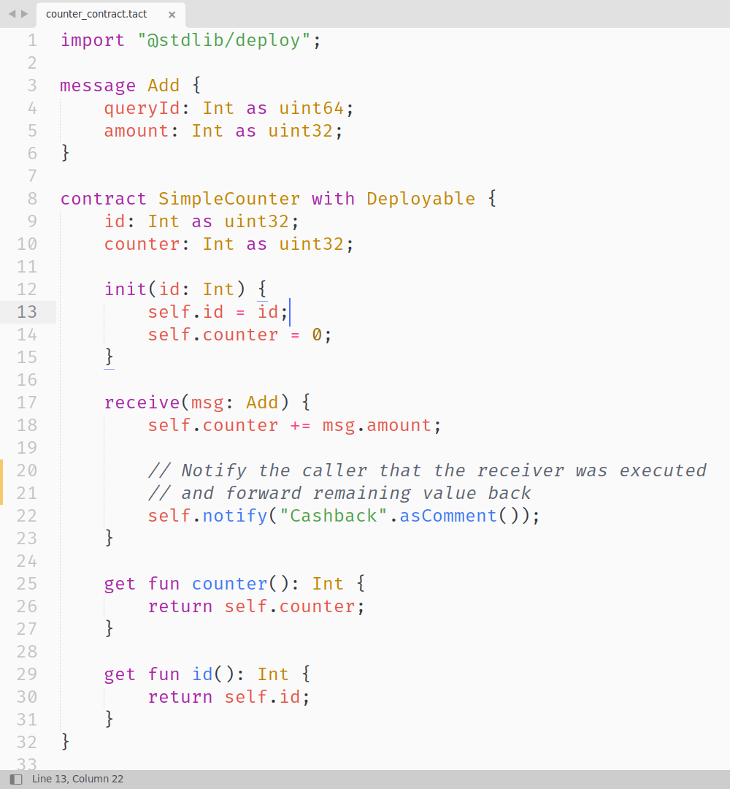
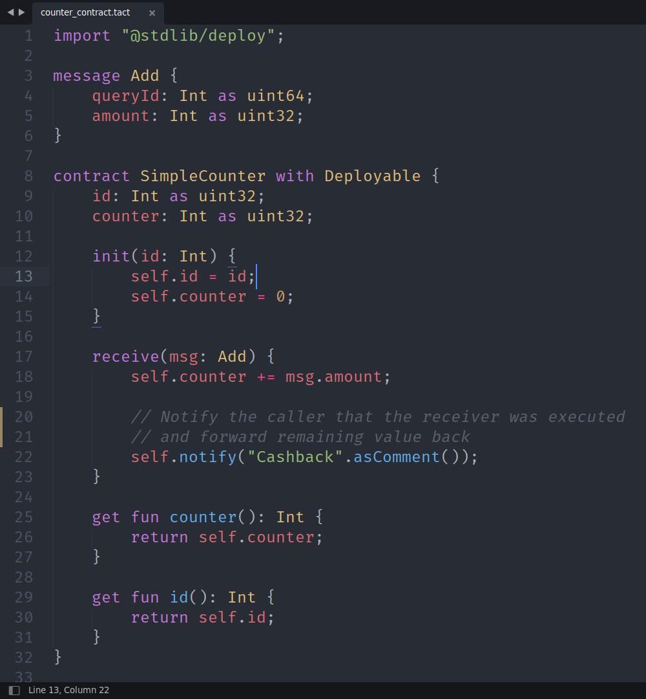
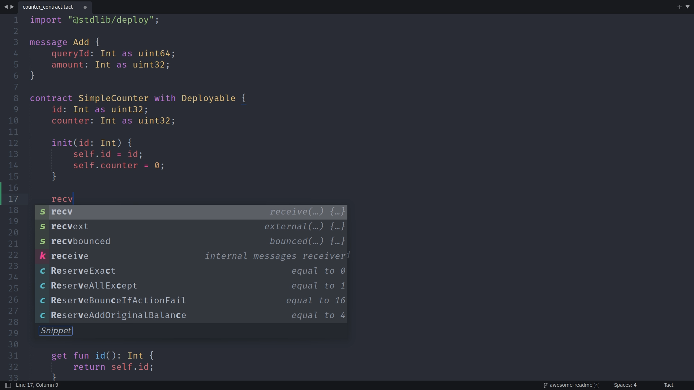
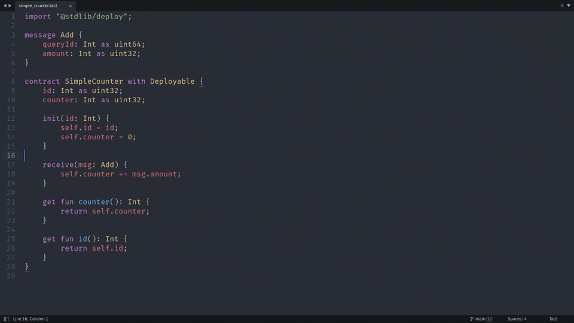
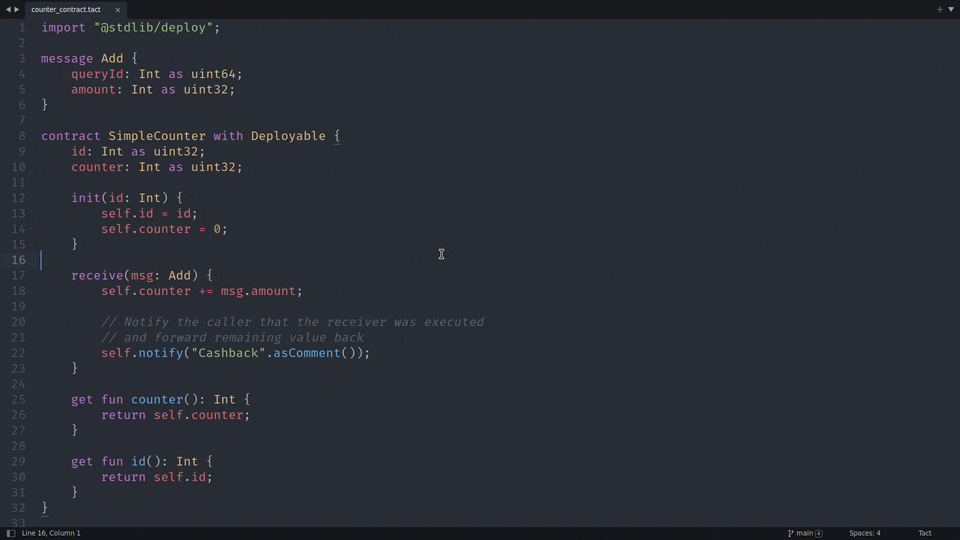
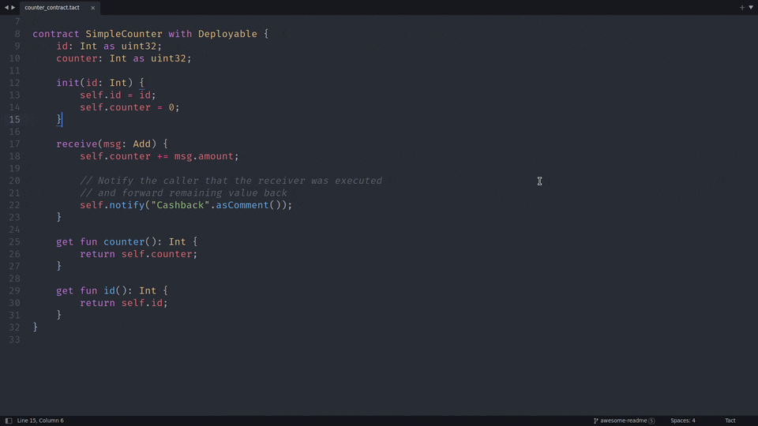
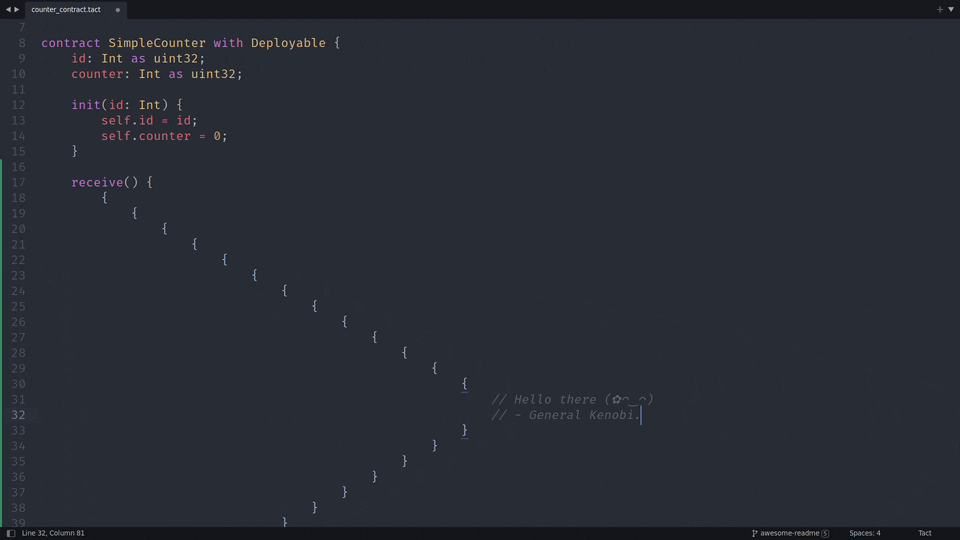
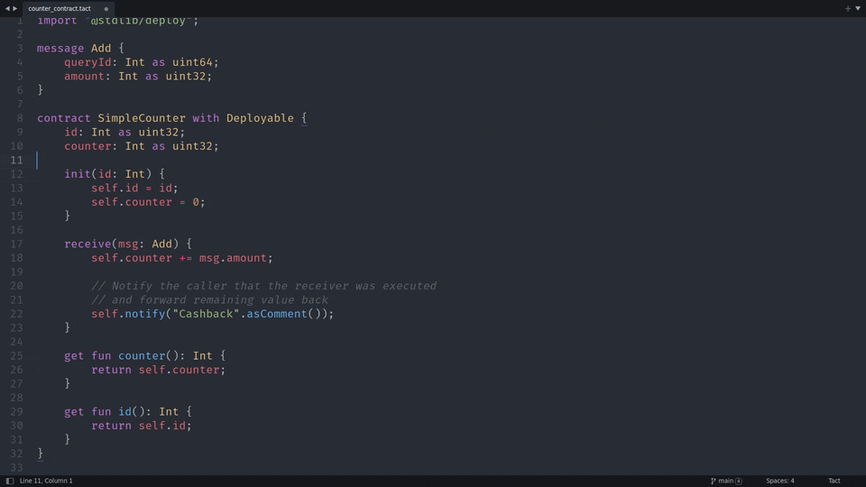

# tact-sublime

  

🚀 Adds syntax highlighting, folding, code snippets, and miscellaneous support for the [Tact programming language](https://tact-lang.org/) to Sublime Text [3* and onward](#compatibility).

⚡ Tact is a fresh programming language for TON blockchain focused on efficiency and simplicity. It is designed to be easy to learn and use and a good fit for smart contracts because it is a statically typed language with a simple syntax and a powerful type system.

## Features

TL;DR? Jump straight to the [installation](#installation)!

### ✨ Syntax highlighting

  
  
  
Color schemes on these screenshots: <i>One Light</i> | <i>One Dark</i>

This package features a comprehensive [TextMate grammar for Tact](package/Tact.tmLanguage.json), which is used for syntax highlighting in Sublime Text, Tact docs, TON Web IDE, and other places. It's thoroughly tested [locally](tests/) and in [GitHub Actions CI](.github/workflows/ci.yml), and it also plays well with [Shiki syntax highlighter](https://github.com/shikijs/shiki).

### ✍ Auto-completions and ⌨ Code snippets

Completions for:

* Various constants, global static functions, and structs from the [core library](https://docs.tact-lang.org/ref). Note that all of the static functions are complete with their expected arguments!
* Literals, such as `true` or `null`
* Keywords, such as `return` or `while`
* Built-in types, such as `Bool` or `map<K, V>`
* Serialization types, like `uint8` or `coins`
* …and more!

Nearly all completions have descriptive annotations and/or clickable links to corresponding explanatory pages in the documentation. Press the "Tact Docs" link at the bottom of the completions window, and it will take you straight to the docs!

Apart from completions, this package also provides a bunch of larger code snippets:

1. Control flow related, like snippets for nested if-else-if or try-catch statements.
2. Import related, like `impdeploy`, which expands to the complete import statement for `@stdlib/deploy`.
3. Various function declaration helpers, like `natfunction` for native functions or `init2` for initialization functions with two parameters
4. Constant and variable declaration helpers, named `constant` and `variable` respectively.
5. A special `sendparams` snippet expands to `send(SendParameters{…})` with some values filled in for your convenience!
6. and more!

**Note** that these completions and snippets are not semantic because they're unaware of code contexts (being inside a function body or declaring a Struct, for example). See the [language server setup](#lsp-integration) to enable semantic completions.

### ✔ Syntax checks

In any Tact project with `node_modules` involved, you can:

1. Open the command palette (<kbd>Ctrl/Cmd</kbd>+<kbd>Shift</kbd>+<kbd>P</kbd>)
2. Select **Build With: Tact**,

which will run syntax and type checking on the currently edited `.tact` file.

### 🗒 Symbol lists

Use <kbd>Ctrl/Cmd</kbd>+<kbd>r</kbd> for opening and searching symbol lists in the current file.

### 👉 Indentation

Mostly accurate indentation support. Although this package doesn't come with a fully-fledged formatter, it tries its utmost to deliver a pleasant editing experience nonetheless.

### `{...}` Folding

Freely collapse and expand chunks of your code in-between braces `{}` or parentheses `()`.

### 💭 Comments

Use <kbd>Ctrl/Cmd</kbd>+<kbd>/</kbd> for a single-line comment toggle and <kbd>Ctrl/Cmd</kbd>+<kbd>Shift</kbd>+<kbd>/</kbd> for multi-line comment toggle.

## Installation

### Through Package Control (Recommended)

This package is available on [Package Control](https://packagecontrol.io/installation). To install it:

1. Open the command palette (<kbd>Ctrl/Cmd</kbd>+<kbd>Shift</kbd>+<kbd>P</kbd>)
2. Select **Package Control: Install Package**
3. Select **Tact**

### Manual installation

1. Open the command palette (<kbd>Ctrl/Cmd</kbd>+<kbd>Shift</kbd>+<kbd>P</kbd>)
2. Select **Preferences: Browse Packages**. It should open the "Packages" directory in your file explorer
3. Clone this repo into that directory

Don't forget to run git pull from time to time to get the latest updates of this package.

## LSP integration

When the language server supports it, the [**LSP** package](https://packagecontrol.io/packages/LSP) enables improved autocomplete, go-to-definition, formatting, "hover docs," compiler errors and warnings, general diagnostics, and more.

To install the base **LSP** package and set up the [official Tact language server](https://github.com/tact-lang/tact-language-server), refer to: [Editor Setup > Sublime Text](https://github.com/tact-lang/tact-language-server#sublime-text).

For additional customization of the **LSP** package, see its [Customization page](https://lsp.sublimetext.io/customization/).

For example, to set up keyboard shortcuts for the language server, see [Key Bindings](https://lsp.sublimetext.io/customization/#keyboard-shortcuts-key-bindings).

## Compatibility

This package's syntax highlighting capabilities target Sublime Text 3+. At the same time, the rest of the features try to target the latest Sublime Text 4+—bugs related to those features failing on any version lower than 4 will not be focused on.

## Useful Tact links

- [Official Website](https://tact-lang.org)
- [Tact Documentation](https://docs.tact-lang.org)
- Discussion Group in [Telegram](https://t.me/tactlang)
- [X/Twitter](https://twitter.com/tact_language)

## Credits

Based on [The Open Network](https://ton.org).

Built with 🤍 by [Novus Nota](https://github.com/novusnota).

## Contributing

When working on the grammar, do it in the JSON file. Then, convert it to Plist (XML) format using the following VSCode extension: [tmLanguage](https://marketplace.visualstudio.com/items?itemName=pedro-w.tmlanguage).

Note that color schemes greatly affect how the grammar looks, and stick to commonly used capture names over trying to nail semantics with more specific ones.

## License

[MIT](LICENSE) © [Novus Nota](https://github.com/novusnota).
